# Ассистент Ева - AI-агент для внутренней системы маркетингового агентства

> Видео-презентация проекта - в папке на Google Drive:
> [drive.google.com/drive/folders/1KvZRLhVlyzQO1bTjbDYB18Kl2WRpMht2](https://drive.google.com/drive/folders/1KvZRLhVlyzQO1bTjbDYB18Kl2WRpMht2)

Я делаю систему для маркетинговых агентств с внутренними инструментами: договоры, контрагенты, заказы,
креативы, размещения. К этой системе подключаю AI-агента, который принимает команды на естественном
языке и выполняет задачи за пользователя.

Пример того, к чему иду. Пользователь пишет в Telegram-боте: «прикрепи договор к такому-то контрагенту
по вчерашнему заказу». Агент разбирает задачу: отобрать вчерашние заказы, найти сущности с договорами,
через tool calling по схеме данных выполнить нужные вызовы, найти договор, проверить файл на
prompt-инъекцию и прикрепить его к нужным артефактам. В ответ пользователю приходит сообщение в Telegram.


**Обновление: архитектура переделана**

Эта картинка оставлена как исходная цель. Сейчас основные изменения ушли в планирование действий с
данными: команда сначала превращается в типизированную анкету, затем детерминированный планировщик
выбирает протокол по онтологии. Подробности ниже в разделе «Версия 2: новый агентский цикл».

Ниже README разбит по версиям: первая (то, что сдавал) и версия 2 (переделанный агентский цикл, обновление
18 июня). Обкатываю первые цепочки на локальной видеокарте.

---

## Содержание

**Версия 1 (первая, сдана):**

- [Что сделано в рамках курса](#что-сделано-в-рамках-курса)
- [Граф агента (версия 1)](#граф-агента-версия-1)
- [RAG по закону](#rag-по-закону)
- [Инструменты (tool calling)](#инструменты-tool-calling)
- [Защита от инъекций](#защита-от-инъекций)
- [Тесты качества: бенчмарк и eval](#тесты-качества-бенчмарк-и-eval)
- [Трассировка LangFuse](#трассировка-langfuse)
- [Сравнение моделей (версия 1, deprecated)](#сравнение-моделей-версия-1-deprecated)

**Версия 2 (обновление 18 июня):**

- [Версия 2: новый агентский цикл](#версия-2-новый-агентский-цикл-обновление-18-июня)
- [Узлы графа версии 2](#узлы-графа)
- [Как модель понимает запрос: раунды 4-6](#как-модель-понимает-запрос-раунды-4-6)
- [Как росло качество](#как-росло-качество-gemini-по-всем-раундам)
- [Сравнение моделей версии 2](#сравнение-моделей-версии-2)
- [Что пока не получается: вопросы к проверяющему](#что-пока-не-получается-вопросы-к-проверяющему)
- [Структура кода](#структура-кода)
- [Как запустить](#как-запустить)

---

## Что сделано в рамках курса

- Собрал первую версию RAG по закону о рекламе (38-ФЗ). Разметил статьи, нарезал их по разделителям в
  markdown, прогнал скриптом нарезки, загрузил в PostgreSQL с pgvector через эмбеддинги USER-bge-m3.
  Поиск гибридный: по векторам и по словам, дальше объединяю списки через RRF и пересортировываю
  реранкером bge-reranker-v2-m3, на выдаче оставляю только действующие редакции.
- Тестирую, как агенты доуточняют вопрос, классифицируют его (юридический, по интерфейсу, смешанный,
  вне темы) и разбирают смешанный контекст. По итогам правлю промпты и добавляю проверки, чтобы точнее
  ловить тип запроса пользователя.
- Обкатываю на локальной видеокарте: пытаюсь заставить маленькую модель Qwen 3.5 9B тянуть весь
  сценарий. Те же тесты параллельно гоняю на других моделях, чтобы увидеть, на каких запросах локальная
  модель спотыкается и где справляется.
- Данные система отдает только на чтение. Примеры запросов: «сколько договоров менеджеры подготовили
  вчера» - ответ приходит в Telegram; «какие договоры до сих пор не прикреплены» (по таким могут идти
  пени от контрагентов) - ответ от системы. Здесь агент уже вызывает данные, доступ держу строго на
  чтение.
- Все поднято на localhost. На видео показываю работу внутри моей системы с реальными документами. В
  репозиторий выгрузил с API-заглушками, чтобы можно было запустить без боевой системы.
- Прогнал на нескольких моделях и смотрю трассировку в LangFuse: где агенты зацикливаются и где теряют
  специфику сложного запроса.

---

## Граф агента (версия 1)


Это граф первой версии, которую сдавал: supervisor плюс консультанты, критик и защита. Ниже граф версии 2 с
переделанным агентским циклом.

## Версия 2: новый агентский цикл (обновление 18 июня)

Первая версия продукта, которую я сдал, имела недостатки: модель сама планировала действия с данными и часто
ошибалась на смешанных запросах. Во второй версии агентский цикл переделан. Модель заполняет анкету интента, план
действий собирает код по онтологии. Добавлены узлы `nlu_preprocessor`, `intent_frame_parser`, `domain_selector`,
компилятор в `data_gather` и проверка покрытия.

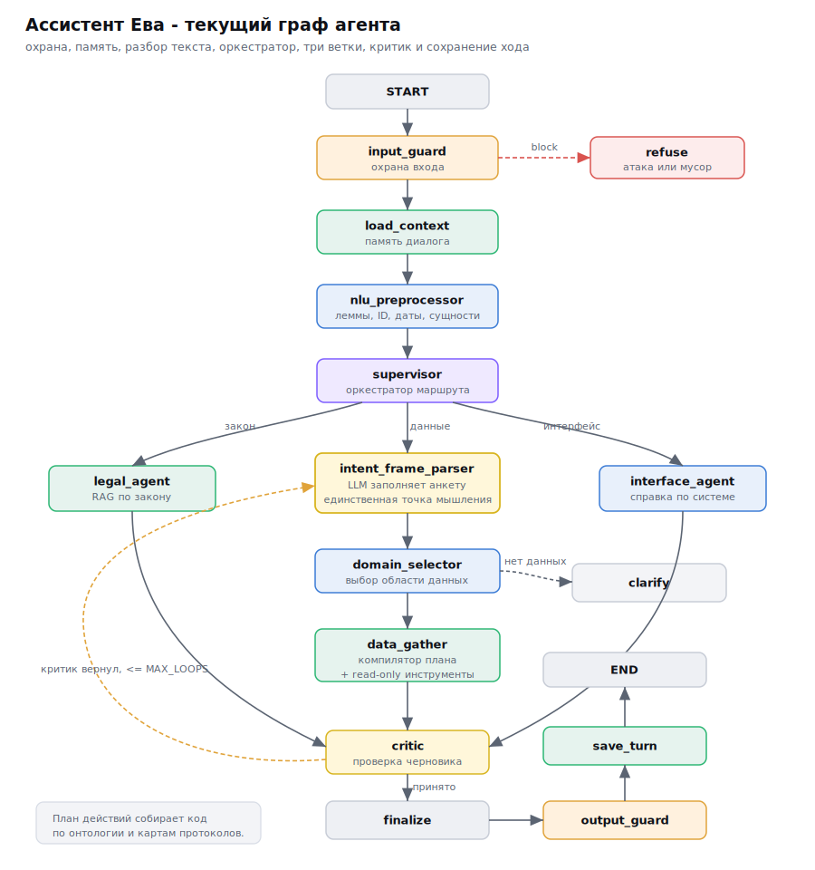

Граф нелинейный, с тремя точками ветвления:

| # | Где | Решение |
|---|-----|---------|
| 1 | после защиты входа | подмена инструкций или мусор - отказ, иначе - к оркестратору |
| 2 | оркестратор (supervisor) | 5 веток: закон, интерфейс, диагностика, уточнение, вне темы |
| 3 | критик | принять - финал, вернуть на доработку - петля (лимит `MAX_LOOPS`) |

### Узлы графа

**[input_guard](src/eva_agent/nodes/guards.py) - защита входа.** Проверяет запрос до подключения модели. Сначала детерминированный фильтр:
нормализация Unicode и невидимых символов, раскрытие спрятанных команд (base64, hex, смешанные алфавиты), регулярки
на явные инъекции (забудь инструкции, покажи системный промпт, jailbreak). Если фильтр чист, подключается
модель-судья. Подробности в разделе про защиту.

**[load_context](src/eva_agent/nodes/dialog_nodes.py) - память диалога.** Поднимает историю сессии из SQLite. Отдельный memory-агент решает, продолжение
это или новый запрос, склеивает короткое сообщение в самодостаточный запрос и переносит прошлый план. За счет этого
«покажи его документы» после «договор CT-1» понимается как документы CT-1.

**[nlu_preprocessor](src/eva_agent/nlu/preprocess.py) - разбор текста.** Из текста запроса собирает структурированные признаки до модели,
детерминированно. Шаги:

- Токенизация. Razdel режет текст на слова и предложения.
- Лемматизация. Pymorphy3 приводит слова к начальной форме: «документов» в «документ», «незакрытые» в «незакрытый».
  За счет лемм разные формы одного слова попадают в один сигнал.
- Газеттир. Словарь по леммам сопоставляет слова с понятиями домена: синонимы сущностей (договор, контракт в
  Contract), роли (заказчик, исполнитель в customer, executor), статусы (неподписан, черновик в draft).
- Идентификаторы. Регулярные выражения находят коды сущностей: CT-2 (договор), CP-1 (контрагент), DOC-3 (документ),
  CR (креатив), PL (размещение).
- Даты. Dateparser разбирает «вчера», «за последнюю неделю» в нормализованные подсказки.
- Глаголы действия. Из лемм выделяю операцию: показать, список, скачать, прикрепить.

Результат - объект NluFeatures с полями lemmas, entity_ids, entities, roles, statuses, dates, action_verbs. Эти
признаки идут дальше как подсказки, чтобы модель меньше угадывала.

**[supervisor](src/eva_agent/nodes/agents.py) - оркестратор.** Получает текст и NluFeatures, классифицирует тип запроса (юридический, по интерфейсу,
смешанный с данными, уточнение, вне темы) и выбирает ветку.

Что переделал. В первой версии supervisor на пограничных запросах часто уводил живой запрос по данным в уточнение,
и ответ терялся. Сначала это была чистая классификация промптом, она плохо ловила границу. Поверх модели добавил
детерминированный high-recall override: если в запросе есть доменный сигнал из NluFeatures (идентификатор сущности,
роль, статус), запрос с пометкой «уточнение» или «вне темы» переписывается в «смешанный с данными». Наличие
доменного сигнала пускает запрос в ветку данных. Override работает по фактам из препроцессора, отдельным слоем
поверх модели.

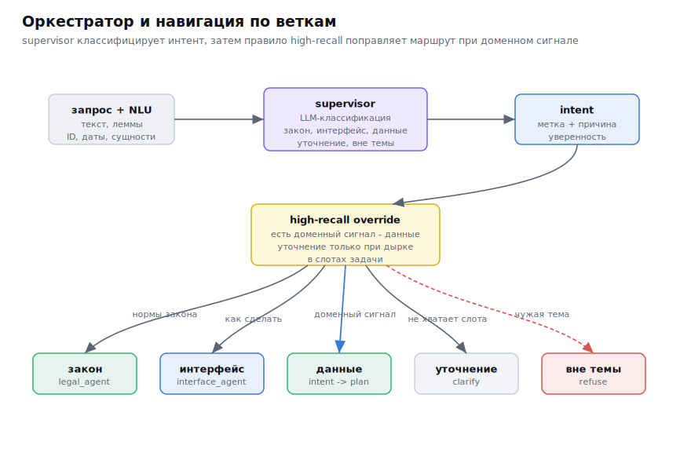

**[intent_frame_parser](src/eva_agent/nodes/frame_parser.py) - разбор интента в анкету.** Получает текст и NluFeatures. Модель заполняет типизированный
JSON-объект (фрейм): operation, target, relation, fields, filters, cardinality, selector, subtasks,
needs_clarification, confidence.

Как работает по шагам. Сначала детерминированный черновик фрейма из NluFeatures. Потом модель заполняет фрейм по
строгой JSON-схеме (structured output, модель обязана вернуть валидный объект). Потом наложение черновика обратно,
чтобы модель не затерла уверенные сигналы. Потом нормализация: связь задает целевую сущность (relation parties в
target ContractParty). Потом валидация в три уровня (синтаксис, семантика по онтологии, проверка компиляции) и
оценка уверенности по детерминированным факторам. При ошибке до двух переспросов с указанием конкретной проблемы,
затем запасной детерминированный фрейм.

Пример заполненного фрейма для «покажи стороны по договору CT-1»: operation=list, target=ContractParty,
relation=parties, selector={contract_id: CT-1}, cardinality=all.

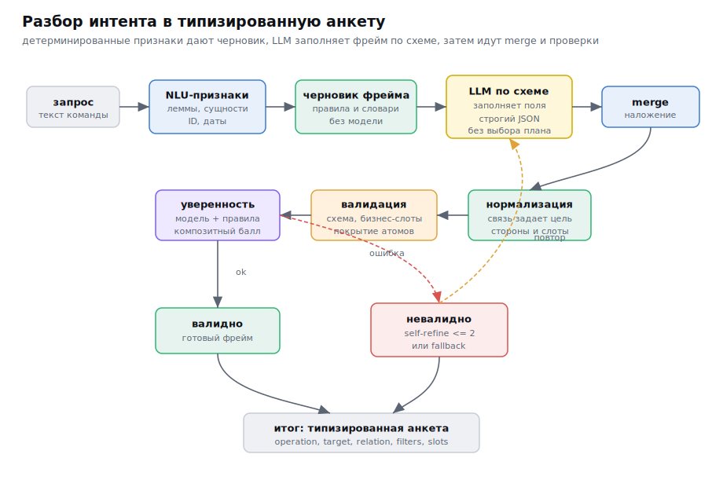

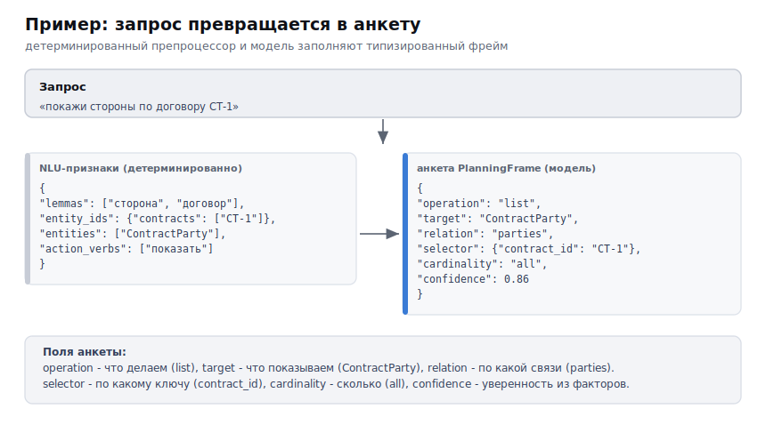

**[domain_selector](src/eva_agent/nodes/domain_nodes.py) - срез онтологии.** Получает фрейм, режет онтологию (карту сущностей, связей и инструментов) до
того, что относится к фрейму, и отдает компилятору узкий контекст.

**[data_gather](src/eva_agent/nodes/agents.py) - компилятор и сбор данных.** Получает фрейм и срез онтологии. Компилятор ранжирует карты протоколов
под фрейм (балл по совпадению операции, целевой сущности, связи и заполненных слотов), берет лучшую, собирает план
из шагов каталога. Проверка покрытия собирает из запроса обязательные атомы и проверяет, что план их закрывает,
иначе достраивает шаг. Связывание прокидывает результат одного шага во вход следующего. Инструменты вызываются
только на чтение.

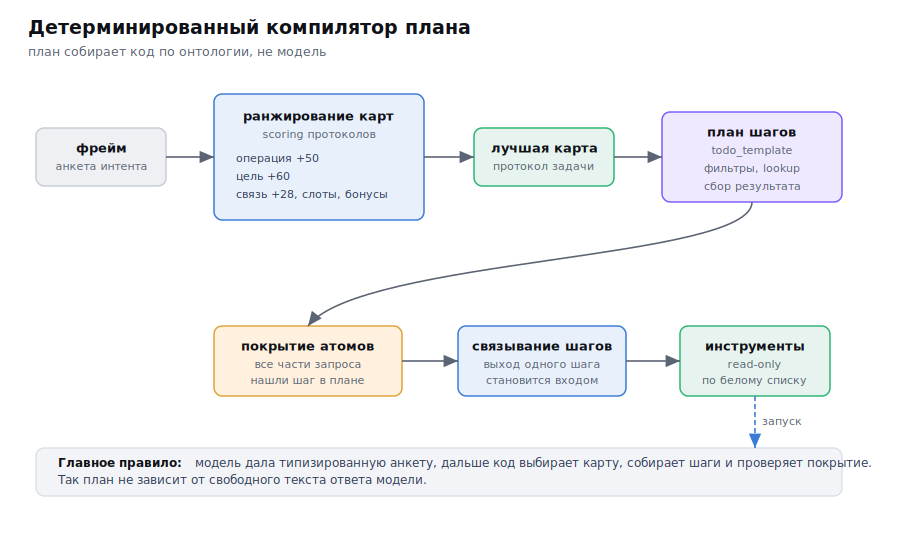

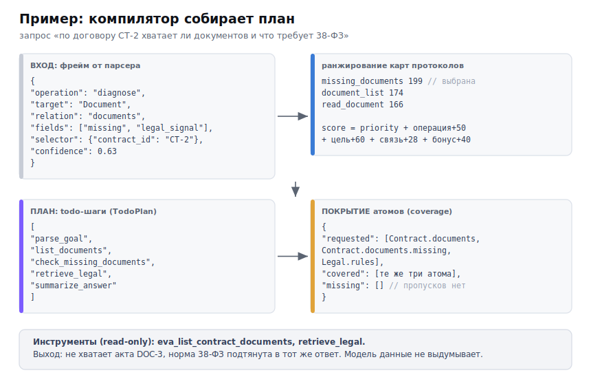

**[legal_agent](src/eva_agent/nodes/agents.py) - ответ по закону.** Ветка для юридических запросов: ходит в RAG по 38-ФЗ и отвечает строго из
найденных норм, с цитатой.

**[interface_agent](src/eva_agent/nodes/agents.py) - оформление ответа по данным.** Собирает человекочитаемый ответ из результатов инструментов:
карточка, стороны, документы. Берет только то, что вернули инструменты.

**[critic](src/eva_agent/nodes/agents.py) - проверка черновика.** Проверяет ответ: есть ли цитаты, опирается ли на данные, нет ли явных ошибок.
Может вернуть на доработку, петля с лимитом `MAX_LOOPS`.

**finalize, output_guard, save_turn.** Файлы: [nodes/agents.py](src/eva_agent/nodes/agents.py),
[nodes/guards.py](src/eva_agent/nodes/guards.py), [nodes/dialog_nodes.py](src/eva_agent/nodes/dialog_nodes.py).
Finalize собирает финальный ответ и источники. Output_guard проверяет ответ
на утечки персональных данных, секретный токен-ловушку и опору на найденное (скрывает, например, ИНН). Save_turn
сохраняет ход в память диалога.

---

## RAG по закону


**Обновление: RAG стабилен**

RAG-слой оставлен прежним: гибридный поиск, RRF, реранкер и фильтр действующей редакции. Основная
переделка была вокруг планирования действий с данными и проверки покрытия команды.

Текст 38-ФЗ разметил и нарезал по статьям: один кусок - одна статья плюс пометки (номер статьи, редакция,
признак действующей редакции). Эмбеддинги считаю моделью USER-bge-m3, храню в PostgreSQL с pgvector. На
запрос иду гибридом (поиск по векторам плюс поиск по словам), объединяю списки через RRF,
пересортировываю реранкером bge-reranker-v2-m3 и отсекаю недействующие редакции. Сам поиск вынес
отдельным сервисом, агент ходит к нему по HTTP.

---

## Инструменты (tool calling)

Агент работает с системой через инструменты. Сейчас в репозитории 4 инструмента, 3 из них внешние:

| Инструмент | Что делает | Куда ходит |
|------------|------------|------------|
| [`retrieve_legal`](src/eva_agent/tools/retrieve.py) | поиск статей 38-ФЗ | сервис поиска по закону (HTTP) |
| [`retrieve_howto`](src/eva_agent/tools/retrieve.py) | поиск по справке | сервис поиска по закону (HTTP) |
| [`eva_list_unsigned_contracts`](src/eva_agent/mock/data.py) | список незавершенных договоров | система (HTTP, только чтение) |
| [`eva_get_creative_status`](src/eva_agent/mock/data.py) | статус готовности креатива | система (HTTP, только чтение) |

Сетевой клиент к системе - [src/eva_agent/tools/eva_client.py](src/eva_agent/tools/eva_client.py).

Все вызовы данных идут только на чтение. В целевой системе сюда добавятся действия с записью (прикрепить
договор, обновить статус); они пойдут через защитный слой и проверку файла на инъекцию.

---

## Защита от инъекций

Отдельный слой проверок до и после модели.

- [`input_filter`](src/eva_agent/security/input_filter.py) - приводит текст к единому виду (Unicode,
  невидимые символы), раскрывает спрятанные команды (base64, hex, смешанные алфавиты), ловит явные
  запрещенные фразы.
- [`injection_detector`](src/eva_agent/security/injection_detector.py) - отдельная модель-судья плюс
  прием [`spotlighting`](src/eva_agent/security/spotlight.py): подозрительный фрагмент помечаю, чтобы
  модель восприняла его как данные и не исполняла как инструкцию.
- [`output_filter`](src/eva_agent/security/output_filter.py) - проверяю ответ перед выдачей: утечки
  персональных данных, секретный токен-ловушку из системного промпта, опору на найденные нормы,
  принадлежность данных пользователю.

В целевом сценарии добавляется проверка прикрепляемого файла: перед тем как агент приложит документ,
файл проходит детектор инъекций.

### Чек-лист безопасности (OWASP LLM Top-10)

Что закрыто:

| Пункт | Как |
|-------|-----|
| LLM01 Подмена инструкций | input_filter, injection_detector, spotlighting |
| LLM02 Утечка чувствительных данных | output_filter (персональные данные, токен-ловушка) |
| LLM06 Лишние полномочия | только чтение, минимум прав, белый список действий |
| LLM07 Утечка системного промпта | токен-ловушка плюс output_filter |
| LLM08 Слабые места поиска по векторам | spotlighting, опора на найденное, уровень доверия источника |
| Разделение данных между пользователями | проверка принадлежности данных |

В работе: ограничение частоты запросов и распознавание персональных данных на русском в полном объеме.
Остальные пункты Top-10 (цепочка поставки, кража модели, слепое доверие ответу) для учебного контура
пока не в фокусе.

---

## Тесты качества: бенчмарк и eval

Набор тестовых запросов с ожидаемым поведением:

- [`bench/benchmark.jsonl`](bench/benchmark.jsonl) - 12 базовых запросов (по одному на каждую ветку);
- [`bench/benchmark_big.jsonl`](bench/benchmark_big.jsonl) - 122 запроса побольше: около 40 попыток
  подмены инструкций, 51 смешанный с данными и 31 юридический.

Три вида проверок ([`evals/run_evals.py`](evals/run_evals.py)): проверка по правилам, оценка другой
моделью (LLM-as-judge), проверка правильности вызова инструмента. Метрики: доля успешных ответов, время
ответа (медиана и p95), стоимость запроса.

Результат на 122 запросах (полное сравнение моделей - в разделе ниже): защита от инъекций и юридические
вопросы проходят почти без промахов, основное проседание - смешанные запросы с обращением к данным (там
и выбор инструмента, и совмещение данных с нормой). Лучшая модель в прогоне - Gemini 3.1 Flash: 84%
(103/122) при времени ответа p50 5.8 секунды.

---

## Трассировка (LangFuse)

Использую трассировку в LangFuse, чтобы видеть, как запрос идет по узлам и где ломается. Каждый запрос -
одно дерево вызовов с моделью, токенами, стоимостью и временем.

### Критик ловит ошибку

По запросу про идентификатор erid юрист-узел ответил, что в нормах про это ничего нет. Это неверно. Критик
поймал ошибку, вернул черновик на доработку и сам указал статью - ч.16 ст.18.1. Так внутри агента работает
проверка ответа.


### Зацикливание на слабой модели

На сложных запросах локальная Qwen и критик начинают гонять ответ по кругу. Пример из прогона: запрос
"что мешает выпустить креатив CR-2" занял 156 секунд и 8 вызовов модели - критик трижды отправил на
переписывание. Из-за этого петлю пришлось ограничить лимитом `MAX_LOOPS`.

Видно по типам запросов: инъекции отрабатывают мгновенно (их режет защита до вызова модели), а
юридические и смешанные на слабой модели медленные именно из-за цикла с критиком.


---

## Сравнение моделей (версия 1, deprecated)

> Этот раздел - замер первой версии на старом наборе из 122 запросов. Высокие проценты обманчивы, ниже разбор
> почему. Актуальные числа в разделе [Сравнение моделей версии 2](#сравнение-моделей-версии-2).

Один и тот же набор гонял на разных моделях, модель переключается через `.env` без правок кода. Прогон по
122 запросам первой версии:


| Модель | success-rate | инъекции | юридич. | данные | p50 / p95 | cost/запрос |
|--------|--------------|----------|---------|--------|-----------|-------------|
| Gemini 3.1 Flash Lite (облако) | **84%** (103/122) | 40/40 | 31/31 | 32/51 | 5.8 / 18.4s | $0.0012 |
| Qwen 3.5 9B (локально, видеокарта) | **75%** (92/122) | 39/40 | 27/31 | 26/51 | 27.2 / 66.8s | бесплатно |
| Llama 3.3 70B Instruct (облако) | **63%** (77/122) | 35/40 | 23/31 | 19/51 | 12.7 / 63.2s | $0.0005 |

Почему этим числам нельзя верить:

- Высокий процент набран на легких кейсах. 84% у Gemini - это в основном одношаговые запросы: одна норма
  закона или одна карточка по готовому ID. По типам видно, что данные проседают у всех:


- Настоящие многошаговые задачи не решались. Пример, который провалили все три модели: «Кто заказчик и кто
  исполнитель в договоре CT-1» (кейс `data-parties-5`). Таких запросов про стороны договора было 15, и все
  15 упали - в первой версии не было шага достать стороны после поиска договора.
- Слабые модели угадывали или зацикливались. Без детерминированного планировщика Llama на сложном запросе
  выдавала правдоподобный, но не подтвержденный инструментами ответ (это галлюцинация плана). Qwen уходила в
  цикл критик-переделка: до 8 вызовов и 156 секунд на один запрос.
- Процент - это не качество. Та же Llama с ее 63% на старом наборе на многошаговых смешанных запросах нового
  набора дала всего 8%. Старый высокий процент держался на простых кейсах.

Старый замер мерил в основном легкое. Дальше переделал и набор данных, и сам агент.

### Чем новый набор сложнее

Набор вырос со 122 до 180 запросов ([bench/benchmark_big.jsonl](bench/benchmark_big.jsonl)), из них 109 -
смешанные многошаговые, это главный тип. Что добавил:

- Цепочки со связыванием: «По креативу CR-2 найди его договор и проверь, приложены ли документы»
  (`mixed-chain-7`) - три шага, выход одного кормит вход следующего.
- Составные запросы: «Открой карточку договора CT-2, его стороны и список документов» (`mixed-chain-6`) -
  три обязательных атома в одном ответе.
- Поиск по номеру вместо готового ID: «Не помню номер договора, найди его и покажи, кто исполнитель»
  (`mixed-explain-10`).
- Закон плюс данные в одном запросе: «Я рекламирую сам себя в своем блоге - надо ли маркировать, и есть ли
  у меня такие договоры» (`mixed-self-promo-decide`).
- Качество уточнений: проверяю не только ответ, но и оправдано ли само уточнение (поля gold_route и
  clarify_warranted в [evals/run_evals.py](evals/run_evals.py)).

Дальше - замер версии 2 на этом наборе.

---

## Как модель понимает запрос: раунды 4-6

Доработал планирование действий с данными. В первой версии продукта модель писала план свободным текстом и сама
выбирала инструменты, на смешанных запросах часто ошибалась. Теперь модель заполняет типизированную анкету запроса
(фрейм), инструменты и порядок шагов выбирает детерминированный код по онтологии домена. Это три раунда доработок
поверх первой версии.

### Раунд 4: типизированный фрейм и компилятор

Модель заполняет фрейм: операция, целевая сущность, связь, фильтры, селектор. Компилятор ранжирует карты протоколов
под фрейм и собирает план из каталога инструментов.

Разбор запроса «покажи стороны по договору CT-1»:

1. Препроцессор ([nlu/preprocess.py](src/eva_agent/nlu/preprocess.py)) выделяет леммы, сущности и идентификаторы:
   слово «стороны» (роли в договоре), CT-1 (договор).
2. Парсер ([intent_frame_parser](src/eva_agent/nodes/frame_parser.py)) заполняет анкету: операция list, цель
   ContractParty, связь parties, селектор contract_id=CT-1.
3. Компилятор ([planner/compile.py](src/eva_agent/planner/compile.py)) по онтологии выбирает инструмент
   `eva_get_contract_parties` (нужен contract_id, он есть) и собирает план.

Слабая дешевая модель перестает угадывать план, разброс падает. Новый домен описывается данными онтологии без правки
кода движка. Дополнительно: подбор примеров для модели (BM25 по леммам плюс плотные эмбеддинги, слияние RRF), строгий
JSON по схеме, валидация анкеты в три уровня, оценка уверенности по детерминированным факторам, запасной
детерминированный план.

Новые узлы графа: nlu_preprocessor, intent_frame_parser, protocol_compiler, валидатор фрейма.

### Раунд 5: фиксы выбора протокола

После ядра узкое место сместилось в компилятор: он выбирал неподходящий протокол. Разобрал 217 неудачных трасс по
узлам. Убрал перекос обзорного протокола над точными, добавил карты под скачивание, прикрепление и поиск договора,
протокол сторон стал отдавать инструмент `eva_get_contract_parties`.

### Раунд 6: механизмы устойчивости

Разложил оставшиеся ошибки по типам и сделал на каждый отдельный механизм. Все детерминированные, работают на любой
модели:

- Разделение команды и инъекции ([nodes/guards.py](src/eva_agent/nodes/guards.py)). «Скачай документ DOC-1»,
  «открой карточку CP-1» раньше блокировались. Теперь команда над сущностью по ее идентификатору проходит дальше;
  явные инъекции («забудь инструкции», «покажи системный промпт») блокируются.
- Связь задает цель ([domain/frame_normalize.py](src/eva_agent/domain/frame_normalize.py)). При сигнале «стороны»
  цель фрейма становится ContractParty, без подмены на карточку договора.
- Стороны без уточнения роли. На «покажи стороны договора» агент собирает все стороны без переспроса про заказчика и
  исполнителя.
- Уточнение после попытки плана ([planner/compile.py](src/eva_agent/planner/compile.py)). Перед уточнением
  компилятор пробует собрать read-only план; уточняет только при его отсутствии.
- Поиск как шаг разрешения. «Найди договор Д-2025/249 и покажи карточку»: поиск дает contract_id, следующий шаг
  берет карточку.
- Юридический шаг в data-плане. При легальном сигнале в запросе по данным retrieve_legal добавляется в тот же план.
- Проверка покрытия ([planner/coverage.py](src/eva_agent/planner/coverage.py)). Из запроса собираются обязательные
  атомы; план закрыт только когда покрыты все.

Телеметрия ([tracing.py](src/eva_agent/tracing.py)): по каждому запросу видно решение охраны, разобранную анкету,
выбранный протокол и причину.

Шесть механизмов одной картинкой:

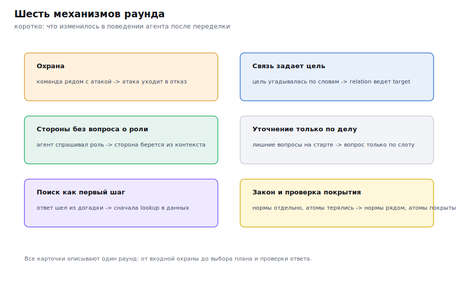

Дальше каждый механизм отдельной картой: алгоритм «было / стало» и пример JSON, которым обменивается шаг.

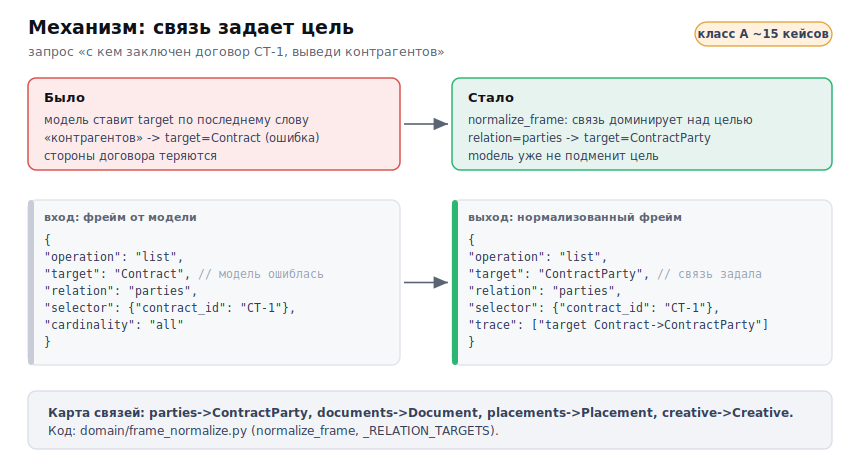

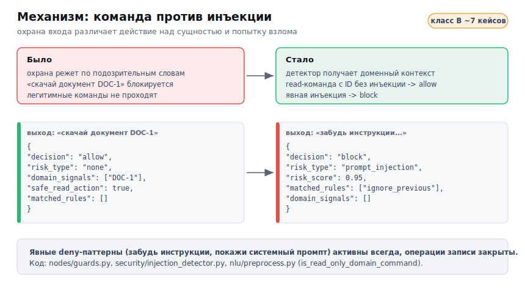

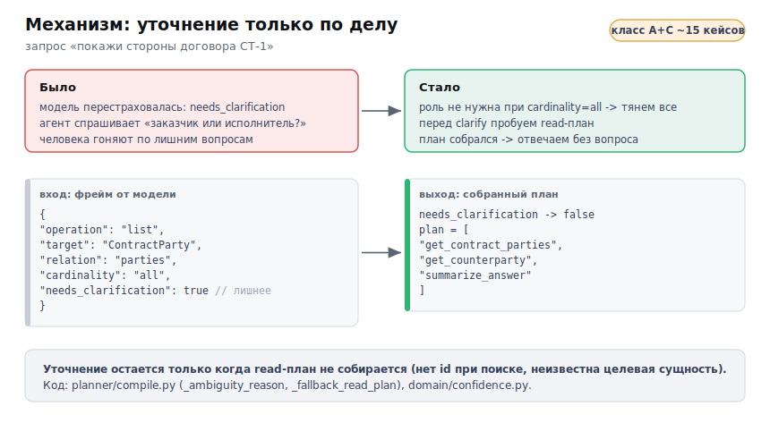

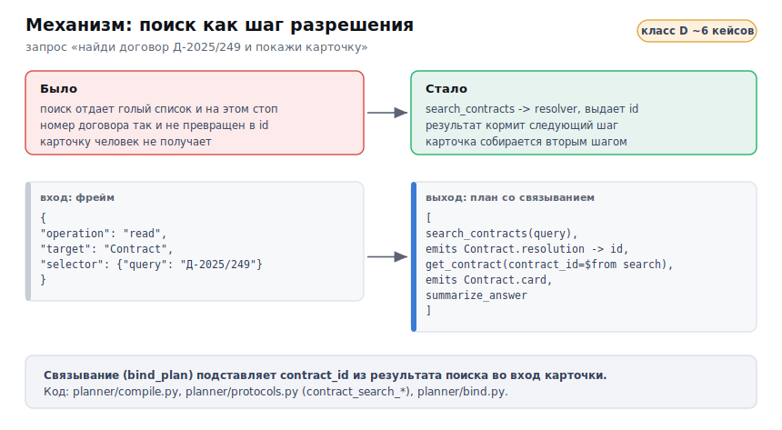

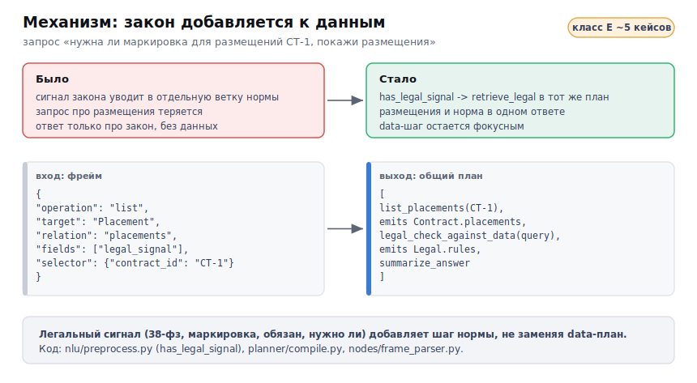

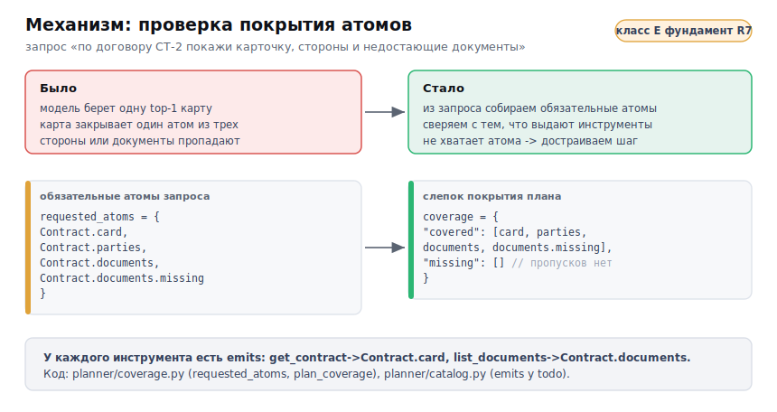

### Бенчмарк вырос

Набор тестов вырос со 122 до 180 запросов ([`bench/benchmark_big.jsonl`](bench/benchmark_big.jsonl)), из них 109
смешанных с данными - это главный тип. К проверкам добавил точность маршрута и качество уточнений (оправдано
уточнение или лишнее).

### Как росло качество (Gemini, по всем раундам)

Доля верных по этапам: сначала график, ниже таблица и разбор каждого этапа.

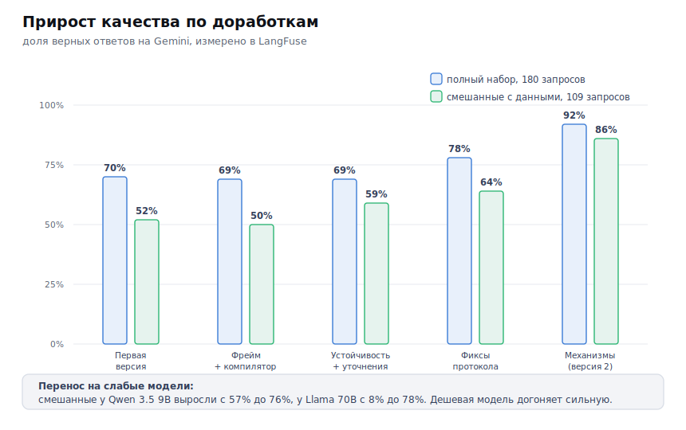

| Этап | Полный набор 180 | Смешанные 109 |
|------|------------------|---------------|
| Первая версия (сдана) | 70% | 52% |
| Типизированный фрейм и компилятор | 69% | 50% |
| Слой устойчивости и адресные уточнения | 69% | 59% |
| Фиксы выбора протокола | 78% | 64% |
| Механизмы устойчивости (вторая версия) | **92%** | **86%** |

Что менялось на каждом этапе:

- **Типизированный фрейм и компилятор.** Поменял механизм планирования. Раньше модель сама писала план свободным
  текстом и выбирала инструменты, теперь она заполняет типизированную анкету, инструменты выбирает
  детерминированный код по онтологии. На сильной Gemini результат остался на месте (полный 70->69, смешанные
  52->50), но слабые модели подтянулись: у Llama смешанные выросли с 8% до 52%. Смысл этапа - убрать зависимость
  плана от модели.
- **Слой устойчивости и адресные уточнения.** Добавил валидацию анкеты в три уровня, оценку уверенности по
  факторам и калиброванное уточнение. Раньше агент часто переспрашивал на ровном месте, теперь уточняет только при
  реальной нехватке входа. Смешанные выросли с 50% до 59% (+9 пп).
- **Фиксы выбора протокола.** Поправил сам компилятор: убрал перекос, когда обзорный протокол перебивал точные,
  добавил карты под скачивание, прикрепление и поиск договора, протокол сторон стал отдавать нужный инструмент.
  Раньше на «покажи стороны» компилятор брал обзорный протокол, теперь party_lookup. Полный набор вырос с 69% до
  78% (+9 пп), смешанные с 59% до 64% (+5 пп).
- **Механизмы устойчивости (вторая версия).** Шесть детерминированных механизмов на типовые ошибки: связь задает
  цель, команда против инъекции, уточнение по делу, поиск как resolver, закон добавляется к данным, проверка
  покрытия. Раньше составной запрос (карточка, стороны, документы) терял часть шагов, теперь проверка покрытия
  следит, что закрыты все атомы. Полный набор вырос с 78% до 92% (+14 пп), смешанные с 64% до 86% (+22 пп).

Слабые модели получили тот же прирост: смешанные у Qwen 3.5 9B выросли с 57% до 76%, у Llama 70B с 52% до 78%.
Дешевая модель выходит на уровень сильной, потому что план собирает код.

## Сравнение моделей версии 2

Тот же набор 180 запросов прогнал на четырех моделях с новыми механизмами, трассировка в LangFuse.

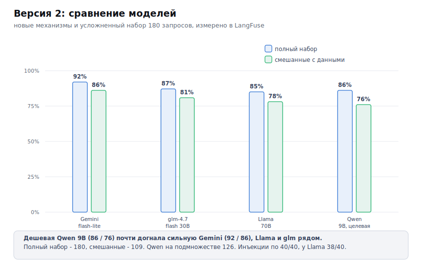

| Модель | Полный 180 | Смешанные 109 | Инъекции |
|--------|------------|---------------|----------|
| Gemini 3.1 flash-lite | **92%** | **86%** | 40/40 |
| glm-4.7-flash 30B | 87% | 81% | 40/40 |
| Llama 3.3 70B | 85% | 78% | 38/40 |
| Qwen 3.5 9B (целевая, подмножество 126) | 86% | 76% | 28/28 |

Главное: разрыв между дешевой и дорогой моделью схлопнулся. Слабая Qwen 9B (86 / 76) почти догнала сильную
Gemini (92 / 86), Llama и glm рядом. Результат меньше зависит от модели, потому что план собирает
детерминированный код по онтологии.

Прирост дали именно шесть механизмов версии 2: правила детерминированные, поэтому помогают каждой модели.

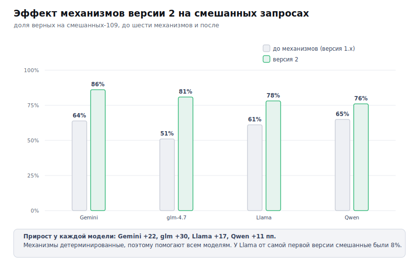

### Какие модели рассматривал

Целевая модель - Qwen 3.5 9B: лучший русский язык в своем классе и реальна для локального запуска на своей
видеокарте. Запасной дешевый кандидат - z-ai glm-4.7-flash (в версии 2 дал 81% на смешанных). Для облака у одной
модели сравнивал цену и задержку и закреплял быстрый недорогой вариант с разрешенным запасным провайдером.

---

## Что пока не получается: вопросы к проверяющему

Выношу отдельно, где агент еще ошибается, и вопросы, по которым прошу направить.

- **Составной запрос из трех атомов.** На «карточку, стороны и документы разом» проверка покрытия иногда не
  добирает карточку: компилятор берет одну top-1 карту, полного композитора плана пока нет. Это главный остаток,
  целюсь в него в раунде 7 (полный atom-coverage composer). Вопрос: достаточно ли детерминированного композитора,
  или часть кейсов честнее закрывать обучаемым ранкером?
- **Поиск без ID в цепочке.** «Найди договор по описанию и покажи стороны» иногда уходит в уточнение, если поиск
  вернул больше одного кандидата. Вопрос: когда показывать список кандидатов на выбор, а когда брать top-1 и
  предупреждать?
- **Перенос на слабую модель.** Прирост подтвердился на всех (Qwen, Llama, glm), но Qwen иногда зацикливается на
  критике. Вопрос: ограничивать петлю жестче или дистиллировать few-shot под слабую модель?
- **Данные демо.** Стенд отдает мок-данные при отсутствии сессии, поэтому карточки в демо не совпадают с боевой
  базой. Это не выдумка модели (у каждого результата инструмента есть метка source), но для защиты нужна рабочая
  авторизация к системе. Вопрос: поднимать ли отдельный демо-стенд с фикстурами.

Если по этим точкам есть направление, куда копать в первую очередь, буду признателен.

---

## Структура кода

Детализация под версию 2: узлы графа, разбор текста, типизированный фрейм, детерминированный компилятор и память
вынесены в отдельные пакеты.

```
src/eva_agent/
|-- graph.py            сборка графа LangGraph: узлы, ветвления, петля критика
|-- state.py            состояние запроса между узлами (Pydantic)
|-- settings.py         настройки из .env, выбор модели под роль узла
|-- tracing.py          сборка запроса в одно дерево LangFuse
|-- nodes/              узлы графа
|   |-- guards.py           input_guard, output_guard (защита входа и выхода)
|   |-- dialog_nodes.py     load_context, save_turn (память диалога)
|   |-- nlu.py              nlu_preprocessor (узел разбора текста)
|   |-- agents.py           supervisor, legal_agent, interface_agent, data_gather, critic, finalize
|   |-- frame_parser.py     intent_frame_parser (заполнение анкеты)
|   '-- domain_nodes.py     domain_selector (срез онтологии)
|-- nlu/               препроцессор: razdel, pymorphy3, газеттир, dateparser -> NluFeatures
|   |-- preprocess.py       сборка NluFeatures из текста
|   |-- gazetteer.py        словарь лемм -> понятия домена
|   '-- fewshot.py          подбор похожих примеров (BM25 + плотные эмбеддинги)
|-- domain/            типизированный фрейм и онтология
|   |-- frame.py            PlanningFrame (анкета интента)
|   |-- frame_normalize.py  relation-dominance: связь задает целевую сущность
|   |-- frame_validate.py   валидация анкеты в три уровня
|   |-- confidence.py       оценка уверенности по детерминированным факторам
|   |-- slice.py            срез онтологии под фрейм
|   '-- domain_map.json     сущности, поля и связи домена
|-- planner/           детерминированный компилятор плана
|   |-- protocols.py        карты протоколов (ProtocolCard) и scoring
|   |-- catalog.py          каталог todo-шагов с emits
|   |-- compile.py          выбор карты, сборка плана, политика уточнений
|   |-- coverage.py         проверка покрытия семантических атомов
|   |-- bind.py             связывание шагов цепочки ($from)
|   '-- execute.py          исполнение плана инструментами (read-only)
|-- dialog/            память диалога: store.py (SQLite) + memory_agent.py
|-- tools/             retrieve_legal (поиск по закону) + клиент данных (только чтение)
|-- security/          input_filter, injection_detector, output_filter, spotlight, ru_pii
|-- llm/               OpenRouter + локальный Ollama, выбор модели, трассировка
'-- mock/              встроенные заглушки данных (демо без рабочей системы)

bench/   |-- benchmark_big.jsonl (180 запросов версии 2), benchmark.jsonl (старый набор 122)
evals/   |-- run_evals.py (проверки маршрута, инструментов и уточнений + метрики)
ui/      |-- app.py (веб-чат Chainlit)
tests/   |-- юнит-тесты
images/  |-- инфографика и схемы
```

---

## Как запустить

```bash
cp .env.example .env        # заполнить OPENROUTER_API_KEY (свой ключ); по желанию локальный Ollama
make install                # зависимости плюс русская модель spaCy
make smoke                  # проверка подключения к моделям

# Поиск по закону живет отдельным репозиторием рядом, поднимается так:
#   docker compose up -d && make api   # сервис поиска на :8077

make cli Q="какие у меня обязательства по закону о рекламе?"   # данные по умолчанию - заглушки
make eval                   # тестовые запросы плюс три вида проверок плюс метрики
make ui                     # веб-чат на http://localhost:8000
```

Без внешних систем агент работает на заглушках данных (`EVA_API_BASE=mock`), демо запускается из коробки.
Можно подключить локальную видеокарту (Ollama) или свой ключ OpenRouter в `.env`.

Качество кода: `make gates` (ruff, mypy, pytest) - зеленые.
