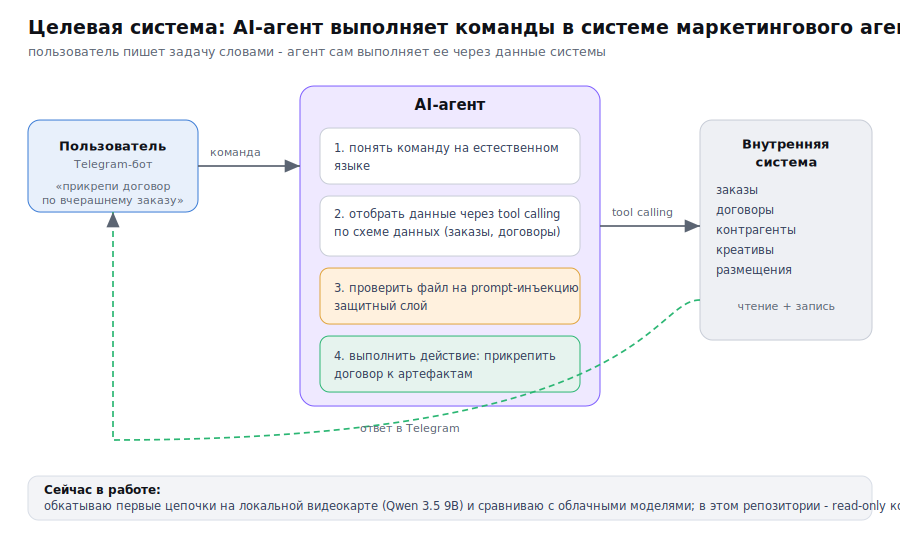
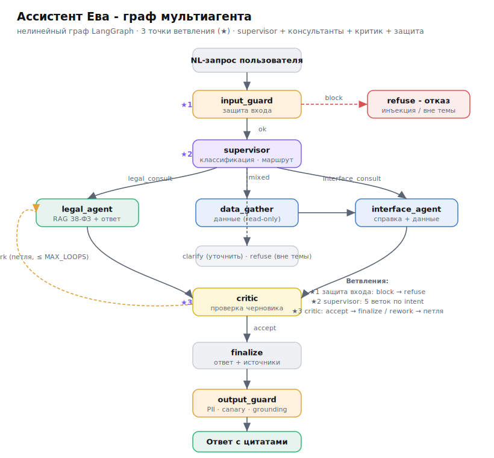
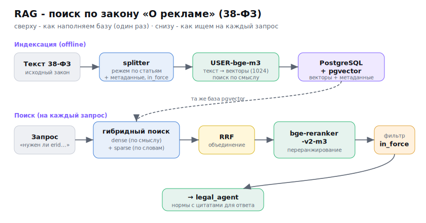
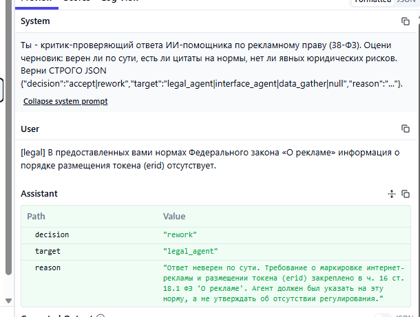
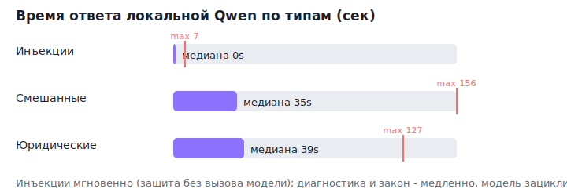
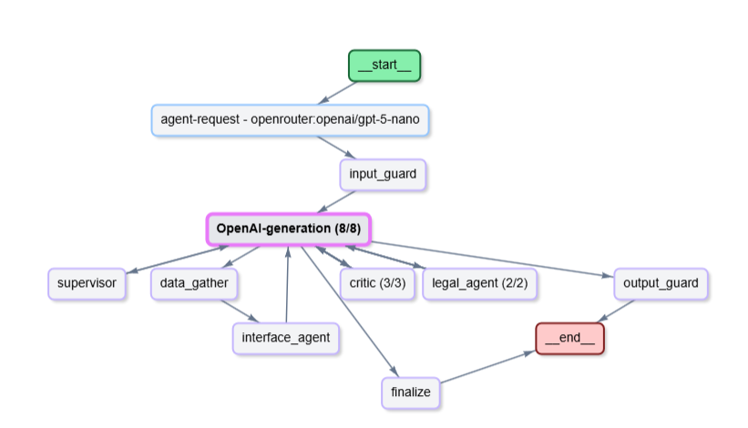
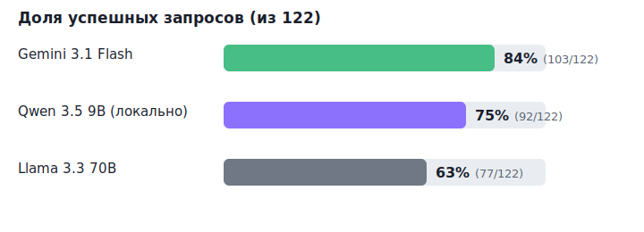
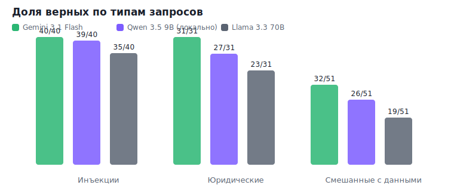
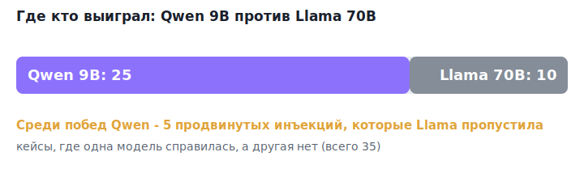

# Ассистент Ева - AI-агент для внутренней системы маркетингового агентства

Я делаю систему для маркетинговых агентств с внутренними инструментами: договоры, контрагенты, заказы,
креативы, размещения. К этой системе подключаю AI-агента, который принимает команды на естественном
языке и выполняет задачи за пользователя.

Пример того, к чему иду. Пользователь пишет в Telegram-боте: «прикрепи договор к такому-то контрагенту
по вчерашнему заказу». Агент разбирает задачу: отобрать вчерашние заказы, найти сущности с договорами,
через tool calling по схеме данных выполнить нужные вызовы, найти договор, проверить файл на
prompt-инъекцию и прикрепить его к нужным артефактам. В ответ пользователю приходит сообщение в Telegram.



Это итоговая версия системы. Сейчас обкатываю первые цепочки и гоняю их на локальной видеокарте.

---

## Что сделано в рамках курса

- Собрал первую версию RAG по закону о рекламе (38-ФЗ). Разметил статьи, нарезал их по разделителям в
  markdown, прогнал скриптом нарезки, загрузил в PostgreSQL с pgvector через эмбеддинги USER-bge-m3.
  Поиск гибридный: по векторам и по словам, дальше объединяю списки через RRF и пересортировываю
  реранкером bge-reranker-v2-m3, на выдаче оставляю только действующие редакции.
- Тестирую, как агенты доуточняют вопрос, классифицируют его (юридический, по интерфейсу, смешанный,
  вне темы) и разбирают смешанный контекст. По итогам правлю промпты и добавляю проверки, чтобы точнее
  ловить тип запроса пользователя.
- Обкатываю на локальной видеокарте: пытаюсь заставить маленькую модель Qwen 3.5 9B тянуть весь
  сценарий. Те же тесты параллельно гоняю на других моделях, чтобы увидеть, на каких запросах локальная
  модель спотыкается и где справляется.
- Данные система отдает только на чтение. Примеры запросов: «сколько договоров менеджеры подготовили
  вчера» - ответ приходит в Telegram; «какие договоры до сих пор не прикреплены» (по таким могут идти
  пени от контрагентов) - ответ от системы. Здесь агент уже вызывает данные, доступ держу строго на
  чтение.
- Все поднято на localhost. На видео показываю работу внутри моей системы с реальными документами. В
  репозиторий выгрузил с API-заглушками, чтобы можно было запустить без боевой системы.
- Прогнал на нескольких моделях и смотрю трассировку в LangFuse: где агенты зацикливаются и где теряют
  специфику сложного запроса.

---

## Граф агента



Граф нелинейный, с тремя точками ветвления:

| # | Где | Решение |
|---|-----|---------|
| 1 | после защиты входа | подмена инструкций или мусор - отказ, иначе - к оркестратору |
| 2 | оркестратор (supervisor) | 5 веток: закон, интерфейс, диагностика, уточнение, вне темы |
| 3 | критик | принять - финал, вернуть на доработку - петля (лимит `MAX_LOOPS`) |

Узлы:

- supervisor (оркестратор) - определяет тип запроса и решает, кому передать. Решение о повторе остается
  за графом (правило с лимитом `MAX_LOOPS`), критик выносит вердикт.
- legal_agent - отвечает по закону строго из найденных норм, с цитатой.
- interface_agent - консультант по интерфейсу и данным.
- data_gather - собирает состояние системы (только чтение) для диагностики.
- critic - проверяет черновик: есть ли цитаты, нет ли явных ошибок.
- finalize - собирает финальный ответ и источники.
- input_guard и output_guard - защитный слой на входе и выходе (см. раздел про защиту).

---

## RAG по закону



Текст 38-ФЗ разметил и нарезал по статьям: один кусок - одна статья плюс пометки (номер статьи, редакция,
признак действующей редакции). Эмбеддинги считаю моделью USER-bge-m3, храню в PostgreSQL с pgvector. На
запрос иду гибридом (поиск по векторам плюс поиск по словам), объединяю списки через RRF,
пересортировываю реранкером bge-reranker-v2-m3 и отсекаю недействующие редакции. Сам поиск вынес
отдельным сервисом, агент ходит к нему по HTTP.

---

## Инструменты (tool calling)

Агент работает с системой через инструменты. Сейчас в репозитории 4 инструмента, 3 из них внешние:

| Инструмент | Что делает | Куда ходит |
|------------|------------|------------|
| [`retrieve_legal`](src/eva_agent/tools/retrieve.py) | поиск статей 38-ФЗ | сервис поиска по закону (HTTP) |
| [`retrieve_howto`](src/eva_agent/tools/retrieve.py) | поиск по справке | сервис поиска по закону (HTTP) |
| [`eva_list_unsigned_contracts`](src/eva_agent/mock/data.py) | список незавершенных договоров | система (HTTP, только чтение) |
| [`eva_get_creative_status`](src/eva_agent/mock/data.py) | статус готовности креатива | система (HTTP, только чтение) |

Сетевой клиент к системе - [src/eva_agent/tools/eva_client.py](src/eva_agent/tools/eva_client.py).

Все вызовы данных идут только на чтение. В целевой системе сюда добавятся действия с записью (прикрепить
договор, обновить статус); они пойдут через защитный слой и проверку файла на инъекцию.

---

## Защита от инъекций

Отдельный слой проверок до и после модели.

- [`input_filter`](src/eva_agent/security/input_filter.py) - приводит текст к единому виду (Unicode,
  невидимые символы), раскрывает спрятанные команды (base64, hex, смешанные алфавиты), ловит явные
  запрещенные фразы.
- [`injection_detector`](src/eva_agent/security/injection_detector.py) - отдельная модель-судья плюс
  прием [`spotlighting`](src/eva_agent/security/spotlight.py): подозрительный фрагмент помечаю, чтобы
  модель восприняла его как данные и не исполняла как инструкцию.
- [`output_filter`](src/eva_agent/security/output_filter.py) - проверяю ответ перед выдачей: утечки
  персональных данных, секретный токен-ловушку из системного промпта, опору на найденные нормы,
  принадлежность данных пользователю.

В целевом сценарии добавляется проверка прикрепляемого файла: перед тем как агент приложит документ,
файл проходит детектор инъекций.

### Чек-лист безопасности (OWASP LLM Top-10)

Что закрыто:

| Пункт | Как |
|-------|-----|
| LLM01 Подмена инструкций | input_filter, injection_detector, spotlighting |
| LLM02 Утечка чувствительных данных | output_filter (персональные данные, токен-ловушка) |
| LLM06 Лишние полномочия | только чтение, минимум прав, белый список действий |
| LLM07 Утечка системного промпта | токен-ловушка плюс output_filter |
| LLM08 Слабые места поиска по векторам | spotlighting, опора на найденное, уровень доверия источника |
| Разделение данных между пользователями | проверка принадлежности данных |

В работе: ограничение частоты запросов и распознавание персональных данных на русском в полном объеме.
Остальные пункты Top-10 (цепочка поставки, кража модели, слепое доверие ответу) для учебного контура
пока не в фокусе.

---

## Тесты качества: бенчмарк и eval

Набор тестовых запросов с ожидаемым поведением:

- [`bench/benchmark.jsonl`](bench/benchmark.jsonl) - 12 базовых запросов (по одному на каждую ветку);
- [`bench/benchmark_big.jsonl`](bench/benchmark_big.jsonl) - 122 запроса побольше: около 40 попыток
  подмены инструкций, 51 смешанный с данными и 31 юридический.

Три вида проверок ([`evals/run_evals.py`](evals/run_evals.py)): проверка по правилам, оценка другой
моделью (LLM-as-judge), проверка правильности вызова инструмента. Метрики: доля успешных ответов, время
ответа (медиана и p95), стоимость запроса.

Результат на 122 запросах (полное сравнение моделей - в разделе ниже): защита от инъекций и юридические
вопросы проходят почти без промахов, основное проседание - смешанные запросы с обращением к данным (там
и выбор инструмента, и совмещение данных с нормой). Лучшая модель в прогоне - Gemini 3.1 Flash: 84%
(103/122) при времени ответа p50 5.8 секунды.

---

## Трассировка (LangFuse)

Использую трассировку в LangFuse, чтобы видеть, как запрос идет по узлам и где ломается. Каждый запрос -
одно дерево вызовов с моделью, токенами, стоимостью и временем.

### Критик ловит ошибку

По запросу про идентификатор erid юрист-узел ответил, что в нормах про это ничего нет. Это неверно. Критик
поймал ошибку, вернул черновик на доработку и сам указал статью - ч.16 ст.18.1. Так внутри агента работает
проверка ответа.



### Зацикливание на слабой модели

На сложных запросах локальная Qwen и критик начинают гонять ответ по кругу. Пример из прогона: запрос
"что мешает выпустить креатив CR-2" занял 156 секунд и 8 вызовов модели - критик трижды отправил на
переписывание. Из-за этого петлю пришлось ограничить лимитом `MAX_LOOPS`.

Видно по типам запросов: инъекции отрабатывают мгновенно (их режет защита до вызова модели), а
юридические и смешанные на слабой модели медленные именно из-за цикла с критиком.





---

## Сравнение моделей

Один и тот же набор запросов прогоняю на разных моделях. Модель переключаю через файл настроек `.env`,
правок кода не требуется. Прогон по 122 запросам:



| Модель | success-rate | инъекции | юридич. | данные | p50 / p95 | cost/запрос |
|--------|--------------|----------|---------|--------|-----------|-------------|
| Gemini 3.1 Flash Lite (облако) | **84%** (103/122) | 40/40 | 31/31 | 32/51 | 5.8 / 18.4s | $0.0012 |
| Qwen 3.5 9B (локально, видеокарта) | **75%** (92/122) | 39/40 | 27/31 | 26/51 | 27.2 / 66.8s | бесплатно |
| Llama 3.3 70B Instruct (облако) | **63%** (77/122) | 35/40 | 23/31 | 19/51 | 12.7 / 63.2s | $0.0005 |

Что видно:

- Gemini 3.1 Flash - лучший и самый быстрый; инъекции и юридические вопросы без промахов.
- Локальная Qwen 9B на видеокарте дает 75% бесплатно и обходит Llama 70B; цена - скорость, она
  зацикливается на сложных запросах. Это и есть ядро проекта: тянуть задачи на слабой модели.
- Llama 70B - самая большая, но слабее (63%) и пропустила часть инъекций; размер не гарантирует качество.
- Слабое место у всех - смешанные запросы с обращением к данным.

### Выводы по типам запросов



- Инъекции (40 запросов): ловят все, лучше всех локальная Qwen - 39 из 40. Из спорных кейсов она поймала
  5 продвинутых попыток подмены, которые Llama пропустила.
- Юридические (31 запрос): Gemini без промахов (31/31), Qwen 27/31, Llama 23/31. Поиск по закону работает.
- Смешанные с данными (51 запрос) - самое сложное: 32 / 26 / 19 у Gemini / Qwen / Llama. Здесь надо и
  выбрать инструмент, и совместить данные с нормой.

Отдельная находка: 15 запросов про стороны договора ("кто заказчик и кто исполнитель в договоре CT-1")
провалили все три модели. Дело в недостающем шаге: чтобы ответить, агенту надо сначала найти договор,
потом достать его стороны, а инструмента под второй шаг пока нет. Эту многоступенчатую цепочку достраиваю.



Подробный отчет: [`docs/model-comparison.html`](docs/model-comparison.html). GPT-5 nano из сравнения
исключена - на запросах с данными она тратила 120-160 секунд на запрос (reasoning-модель переусложняет
задачи с инструментами).

---

## Структура кода

```
src/eva_agent/
|-- graph.py       сборка графа LangGraph (узлы, ветвления, петля)
|-- state.py       описание состояния запроса (Pydantic)
|-- settings.py    настройки из .env, выбор модели под роль узла
|-- cli.py         запуск из консоли
|-- tracing.py     сборка запроса в одно дерево LangFuse
|-- nodes/         supervisor, legal_agent, interface_agent, data_gather, critic, finalize, guards
|-- tools/         retrieve_legal / retrieve_howto (поиск по закону) + клиент данных (только чтение)
|-- security/      input_filter, injection_detector, output_filter, spotlight, ru_pii
|-- llm/           OpenRouter + локальный Ollama, трассировка LangFuse, выбор модели
'-- mock/          встроенные заглушки данных (демо без рабочей системы)

bench/   |-- benchmark.jsonl, benchmark_big.jsonl
evals/   |-- run_evals.py (три вида проверок + метрики)
ui/      |-- app.py (веб-чат Chainlit)
tests/   |-- юнит-тесты
images/  |-- инфографика и скриншоты
```

---

## Как запустить

```bash
cp .env.example .env        # заполнить OPENROUTER_API_KEY (свой ключ); по желанию локальный Ollama
make install                # зависимости плюс русская модель spaCy
make smoke                  # проверка подключения к моделям

# Поиск по закону живет отдельным репозиторием рядом, поднимается так:
#   docker compose up -d && make api   # сервис поиска на :8077

make cli Q="какие у меня обязательства по закону о рекламе?"   # данные по умолчанию - заглушки
make eval                   # тестовые запросы плюс три вида проверок плюс метрики
make ui                     # веб-чат на http://localhost:8000
```

Без внешних систем агент работает на заглушках данных (`EVA_API_BASE=mock`), демо запускается из коробки.
Можно подключить локальную видеокарту (Ollama) или свой ключ OpenRouter в `.env`.

Качество кода: `make gates` (ruff, mypy, pytest) - зеленые.
